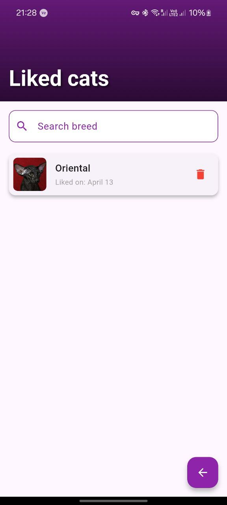

# Кототиндер - Приложение для любителей котов

Добро пожаловать в **Tindercat** — мобильное приложение, которое позволяет пользователям наслаждаться красотой и разнообразием котов! Это приложение вдохновлено идеей Tinder, но посвящено исключительно котикам. Пользователи могут свайпать карточки с фотографиями котов, лайкать своих любимцев, просматривать подробную информацию о породах и возвращаться к истории своих лайков.

## Описание приложения

Приложение предлагает интуитивно понятный интерфейс, где пользователи могут:
- Свайпать карточки с фотографиями котов влево (дизлайк) или вправо (лайк).
- Просматривать подробные сведения о лайкнутых котах, включая название породы, описание, характер, происхождение и ожидаемую продолжительность жизни.
- Отслеживать количество лайков и просматривать историю лайкнутых котов.

## Реализованные фичи

- **Главная страница (HomeScreen)**:
    - Отображение случайных фотографий котов с возможностью свайпа влево (дизлайк) или вправо (лайк).
    - Кнопки "Лайк" и "Дизлайк" внизу экрана для ручного выбора.
    - Переход на страницу деталей по нажатию на карточку.
    - Счетчик лайков и кнопка истории в верхней панели.

- **Страница детальной информации (DetailScreen)**:
    - Отображение большой фотографии кота.
    - Информация о породе: название, описание, характер, происхождение и продолжительность жизни.
    - Кнопка "Назад" для возвращения на главную страницу.

- **Страница истории (HistoryScreen)**:
    - Список лайкнутых котов с миниатюрами и названиями пород.
    - Возможность просмотра деталей каждого кота из истории.

## Скриншоты

  
*Главный экран с карточкой кота и кнопками лайка/дизлайка.*

  
*Страница деталей с информацией о породе.*

  
*Страница истории с лайкнутыми котами.*

## Ссылка на скачивание APK

Вы можете скачать последнюю версию приложения по [этой ссылке](https://example.com/kototinder.apk).  
*(Примечание: Замените `https://example.com/kototinder.apk` на реальную ссылку, где будет размещен ваш APK-файл. Например, вы можете загрузить APK на Google Drive, GitHub Releases или другой хостинг и вставить ссылку.)*

## Установка и запуск

1. Убедитесь, что у вас установлен [Flutter](https://flutter.dev) и настроена среда разработки.
2. Склонируйте репозиторий
3. Перейдите в директорию проекта
4. Установите зависимости `flutter pub get`
5. Запустите приложение на эмуляторе или подключённом устройстве `flutter run`